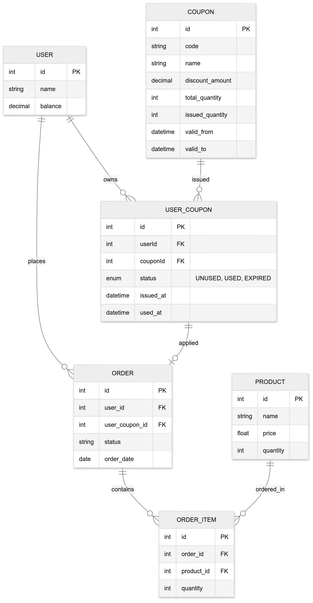

## Server Building for E-Commerce Service

### Design

<details>
    <summary>1. Sequence Diagram</summary>
<details>
    <summary>1. 잔액 충전 또는 조회</summary>
    
```mermaid
sequenceDiagram
    actor Client
    participant API_Server
    participant Balance_Service
    participant User_DB

    %% 잔액 충전 API
    Client->>API_Server: POST /chargeBalance (userId, amount)
    API_Server->>Balance_Service: chargeBalance(userId, amount)
    Balance_Service->>User_DB: getUserBalance(userId)
    User_DB-->>Balance_Service: currentBalance
    Balance_Service->>User_DB: updateBalance(userId, currentBalance + amount)
    User_DB-->>Balance_Service: updateResult
    Balance_Service-->>API_Server: success or error
    API_Server-->>Client: 200 OK (잔액 충전 성공 메시지)

    %% 잔액 조회 API
    Client->>API_Server: GET /getBalance?userId=...
    API_Server->>Balance_Service: getBalance(userId)
    Balance_Service->>User_DB: getUserBalance(userId)
    User_DB-->>Balance_Service: currentBalance
    Balance_Service-->>API_Server: currentBalance
    API_Server-->>Client: 200 OK (잔액: currentBalance)

````
</details>

<details>
    <summary>2. 상품 조회</summary>

```mermaid
sequenceDiagram
    actor Client
    Participant API_Server
    Participant Product_Service
    Participant Product_DB

    Client -> API_Server: GET /products
    API_Server -> Product_Service: getProductList()
    Product_Service -> Product_DB: getProducts()
    Product_DB --> Product_Service: List<Product>
    Product_Service --> API_Server: List<Product>
    API_Server --> Client: 200 OK (상품 목록 반환)
````

</details>

<details>
    <summary>3. 선착순 쿠폰 기능</summary>

```mermaid
sequenceDiagram
    Participant Client
    Participant API_Server
    Participant Coupon_Service
    Participant Coupon_DB

    Client -> API_Server: POST /issueCoupon (userId)
    API_Server -> Coupon_Service: issueCoupon(userId)
    Coupon_Service -> Coupon_DB: getCoupon()
    alt 발급 가능
        Coupon_Service -> Coupon_DB: addIssuedCoupon(userId)
        Coupon_DB --> Coupon_Service: success
        Coupon_Service --> API_Server: Coupon 발급 성공
    else 발급 마감
        Coupon_Service --> API_Server: 쿠폰 소진 오류
    end
    API_Server --> Client: 결과 응답 (성공 or 실패)
```

</details>

<details>
    <summary>4. 주문 / 결제 기능</summary>


</details>

<details>
    <summary>5. 상위 상품 조회</summary>


</details>
</details>

<details>
    <summary>2. ERD</summary>

</details>

<details>
    <summary>3. Infrastructure Diagram</summary>
    

</details>
```
