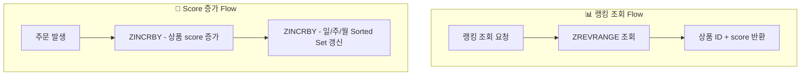

# Redis 기반 상품 주문 랭킹 설계

## 1. Flow



### 1.1 Sorted Set Add

- **주문 시:**

  - Redis의 Sorted Set(`ZINCRBY`)을 사용하여 상품 ID를 key로, 주문 수를 score로 저장
  - 예시: `ZINCRBY product:order:daily:20250101 1 <product_id>`

### 1.2 Get Rank (with Scores)

- 랭킹 조회 시 `ZREVRANGE` 명령어를 사용하여 score와 함께 반환
- 예시: `ZREVRANGE product:order:daily:20250101 0 9 WITHSCORES` (상위 10개)

### 1.3 기간별 랭킹

- **일별:** `product:order:daily:<yyyyMMdd>`
- **주간별:** `product:order:weekly:<yyyyWW>`
- **월별:** `product:order:monthly:<yyyyMM>`
- 주문 발생 시 해당 기간의 Sorted Set에 동시에 반영

### 1.4 동일 점수 처리

- Redis Sorted Set은 score가 같을 경우 lexicographical order(사전순)로 정렬
- 동일 점수일 때 상품 ID 기준 오름차순 정렬됨
- 필요 시 tie-breaker(예: 최근 주문 시간) 추가 고려

## 2. 참고 명령어

- `ZADD`, `ZINCRBY`, `ZRANGE`, `ZREVRANGE`, `ZREVRANK`, `ZCARD`, `ZREM`

## 3. 예시

```shell
# 주문 발생 시
ZINCRBY product:order:daily:20240601 1 12345

# 일별 랭킹 조회
ZREVRANGE product:order:daily:20240601 0 9 WITHSCORES
```
